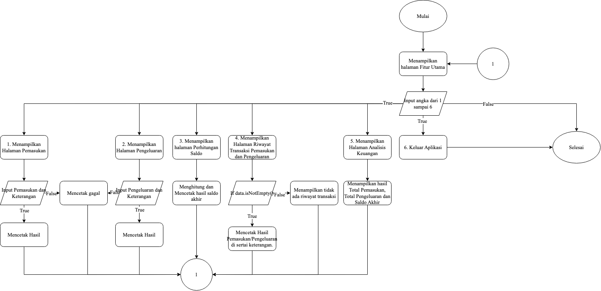
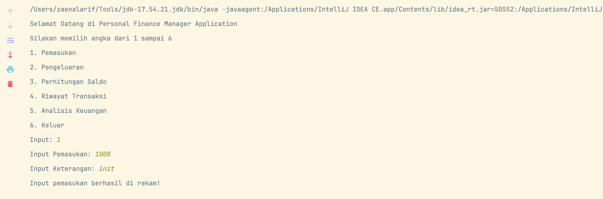
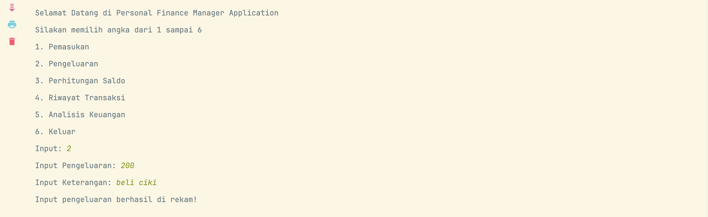
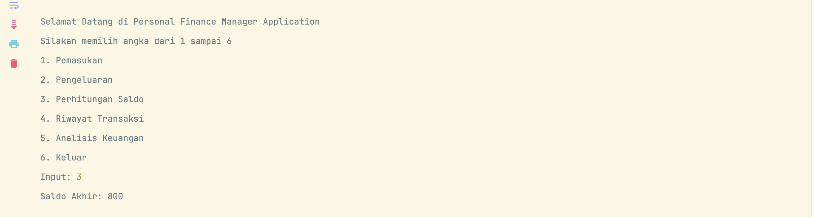
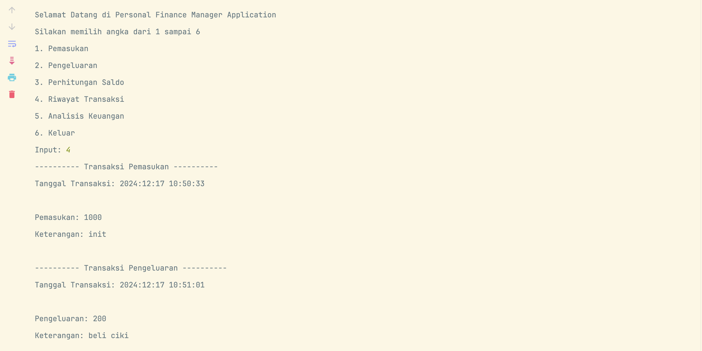
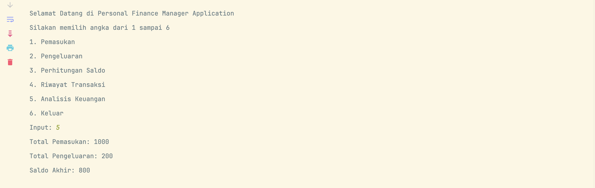
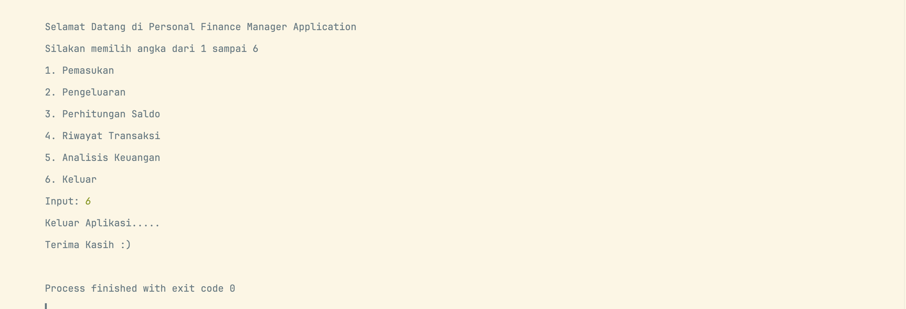

# Personal Finance Manager Application

*Personal Finance Manager Application* adalah aplikasi manajemen keuangan yang sederhana. Aplikasi ini dapat membantu
melacak aktivitas keuangan seperti pemasukan atau pengeluaran, beserta keterangannya.

# Daftar isi

- [Fitur Utama](#fitur-utama)
- [Flowchart](#flowchart)
- [Screenshot](#screenshot)

### Fitur Utama

> - **Input Pemasukan dan Pengeluaran:** Pengguna dapat memasukan jumlah pemasukan atau pengeluaran bersama dengan
    keterangan.
> - **Perhitungan Saldo:** Aplikasi secara otomatis menghitung saldo akhir berdasarkan pemasukan dan pengeluaran.
> - **Riwayat Transaksi:** Menampilkan riwayat semua pemasukan dan pengeluaran.
> - **Analisis Keuangan:** Menampilkan jumlah total pemasukan, pengeluaran dan saldo akhir.

### Flowchart

| Image                            |
|----------------------------------|
|  |

### Screenshot

| Halaman Menu Utama                | Halaman Pemasukan            | Halaman Pengeluaran            |
|-----------------------------------|------------------------------|--------------------------------|
|  |  |  |

| Halaman Perhitungan Saldo                | Halaman Riwayat Transaksi                             | Halaman Analisis Keuangan                           |
|------------------------------------------|-------------------------------------------------------|-----------------------------------------------------|
|  |  |  |

| Halaman Keluar Aplikasi         |
|---------------------------------|
|  |