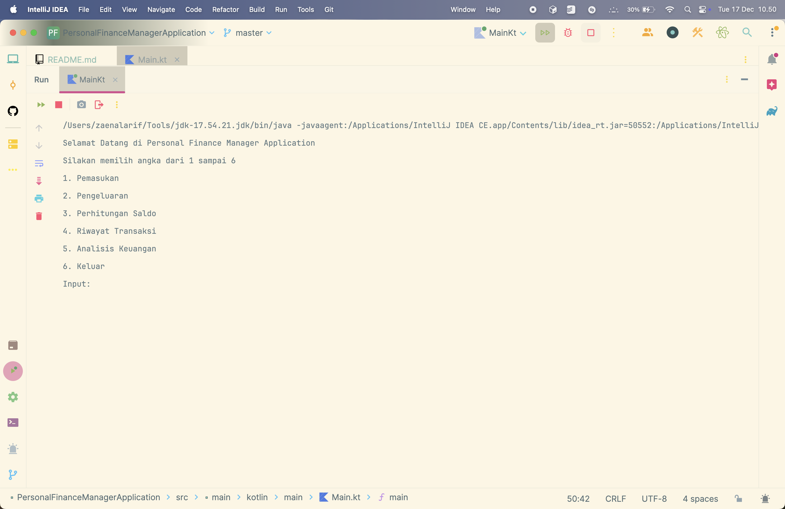

[](https://openjdk.org/)
[](http://kotlinlang.org)
[](https://developer.android.com/studio/releases/gradle-plugin)

# Personal Finance Manager Application

*Personal Finance Manager Application* adalah aplikasi manajemen keuangan yang sederhana. Aplikasi ini dapat membantu
melacak aktivitas keuangan seperti pemasukan atau pengeluaran, beserta keterangannya.

## Table of Contents

- [Features](#features)
- [Technology Used / Tech Stack](#technology-used--tech-stack)
- [Installation (How to run the project)](#installation-how-to-run-the-project)
- [Tree / Folder Structure](#tree--folder-structure)
- [Done](#done)
- [Flowchart](#flowchart)
- [Preview](#preview)
- [Demo](#demo)
- [Credit / Contributor(s)](#credit--contributors)

## Features

> - **Input Pemasukan dan Pengeluaran:** Pengguna dapat memasukan jumlah pemasukan atau pengeluaran bersama dengan
    keterangan.
> - **Perhitungan Saldo:** Aplikasi secara otomatis menghitung saldo akhir berdasarkan pemasukan dan pengeluaran.
> - **Riwayat Transaksi:** Menampilkan riwayat semua pemasukan dan pengeluaran.
> - **Analisis Keuangan:** Menampilkan jumlah total pemasukan, pengeluaran dan saldo akhir.

## Technology Used / Tech Stack
>- Programming Language: Kotlin
>- Build Tool: Gradle

## Installation (How to run the project)
To run the project locally, follow these steps:
### 1. Clone the repository
>- ```git clone https://github.com/zenmobiledev/personal-finance-manager.git ```
>- ```cd personal-finance-manager```

### 2. Open the project
>- Launch **IntelliJ IDEA**.
>- Select **File** > **Open** and navigate to the project directory.

### 3. Build the project
>- Ensure you have the necessary SDKs and dependencies installed.
>- Click on the **Build** menu and select **Build Project**.

### 4. Run the application
>- Navigate to the ```Main.kt``` file.
>- Click the green play button next to the ```main()``` function

## Tree / Folder Structure
```
.
└── src
    └── main
        └── kotlin
            ├── data
            ├── features
            ├── main
            └── utils
```

## Done
**Point Penilaian**:
>- [x] Basic Functionality (Variables and Data Types, Arithmetic Operation, etc)
>- [x] Control Flow (IF-Else, When, Looping)
>- [x] Function Definition and Utilization
>- [x] OOP Concepts (Classes, Objects, Properties, Methods)
>- [x] Collection Data Management (MutableList)

**Fitur Aplikasi**:
>- [x] Input Pemasukan dan Pengeluaran
>- [x] Perhitungan Saldo
>- [x] Riwayat Transaksi
>- [x] Analisis Keuangan

## Flowchart

| Image                            |
|----------------------------------|
|  |

## Preview

| Halaman Menu Utama                | Halaman Pemasukan            | Halaman Pengeluaran            |
|-----------------------------------|------------------------------|--------------------------------|
|  |  |  |

| Halaman Perhitungan Saldo                | Halaman Riwayat Transaksi                             | Halaman Analisis Keuangan                           |
|------------------------------------------|-------------------------------------------------------|-----------------------------------------------------|
|  |  |  |

| Halaman Keluar Aplikasi         |
|---------------------------------|
|  |

## Demo

https://github.com/user-attachments/assets/edf73eba-6207-48e8-98c9-e11cc503da98

## Credit / Contributor(s)
- [Zaenal Arif](https://github.com/zenmobiledev)
